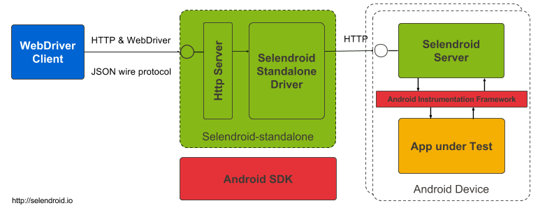

# 基本组件

Selendroid 有四大组件：

1. Selendroid-Client：Java 客户端（基于 Selenium Webdriver API 实现的）
2. Selendroid-Server：运行在安卓设备中 instrumentation server。和被测应用统一签名，运行在同一进程。
3. AndroidDriver-App：一个 android webview 应用，用来测试移动网页的。
4. Selendroid-Standalone：大管家，负责将 Selendroid-Server 和 被测应用安装到设备中去，同时负责管理不同的安卓设备。

其中 selendroid-standalone.jar 包含了 standalone-server， selendroid-server 和 selendroid-client driver。
